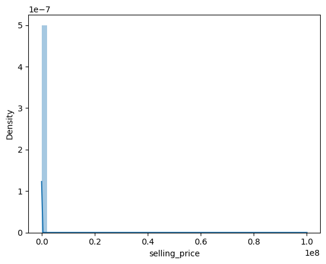
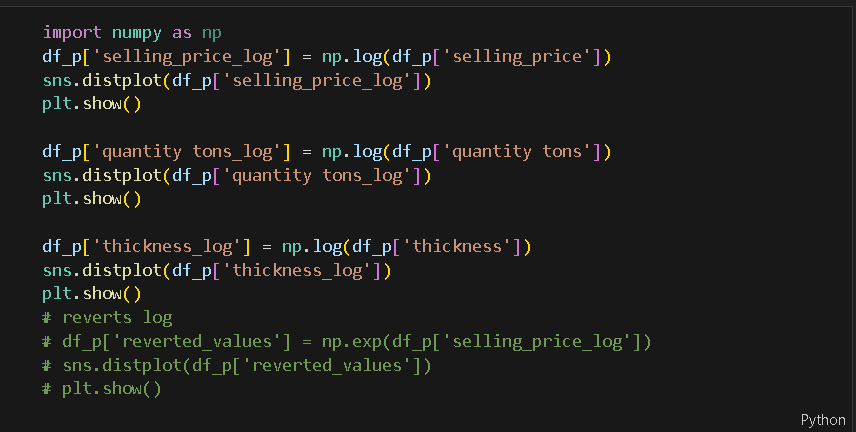
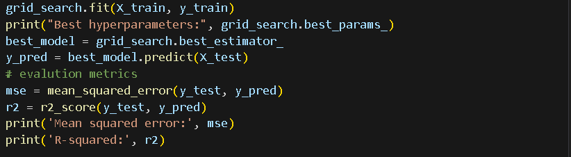

# NAMA : REZA RADITYA
# NIM : 231352004

<body>

# Link Data

link file keseluruhan: https://github.com/rezaraditya/dtstream/tree/main/Industrial-Copper-Modeling-Project-main/Industrial-Copper-Modeling-Project-main
 

link ipynb: https://github.com/rezaraditya/dtstream/blob/main/Industrial-Copper-Modeling-Project-main/Industrial-Copper-Modeling-Project-main/EDA_COPPER.ipynb

## 1. Pendahuluan
<h4>Proyek ini bertujuan untuk mengembangkan dua model pembelajaran mesin untuk industri tembaga guna mengatasi tantangan dalam memprediksi harga jual dan klasifikasi timbal. Prediksi manual dapat memakan waktu dan mungkin tidak menghasilkan keputusan penetapan harga yang optimal atau menangkap prospek secara akurat. Model-model tersebut akan menggunakan teknik-teknik canggih seperti normalisasi data, deteksi dan penanganan outlier, penanganan data dalam format yang salah, identifikasi distribusi fitur, dan pemanfaatan model berbasis pohon, khususnya algoritma pohon keputusan, untuk memprediksi harga jual dan prospek secara akurat. .
</h4>

## 2. Data Exploration
<h4>Adapun EDA decision tree ditampilkan sebagai berikut : </h4>

Accuracy: 0.912118593365685
Confusion Matrix:
[[ 5692  1310]
 [ 1334 21750]]

Confusion Matrix:
[[ 5692  1310]
 [ 1334 21750]]
 

<h3> Classification Report : </h3>

 

              precision    recall  f1-score   support

           0       0.81      0.81      0.81      7002
           1       0.94      0.94      0.94     23084

    accuracy                           0.91     30086
   macro avg       0.88      0.88      0.88     30086
weighted avg       0.91      0.91      0.91     30086
   
=

## 3. Data_Preprocessing

###  IMPORT LIBRARY

 

import warnings

warnings.filterwarnings("ignore")
 

import pandas as pd

###  Read the CSV file into a pandas dataframe
<h5>df = pd.read_csv</h5> 
 
(r"C:\Users\91939\OneDrive\Desktop\Copper_P4\DATASET\INDUSTRY_COPPER.csv")
df.head(2) 

<table  class="dataframe">
  <thead border=4>
    <tr style="text-align: center;">
      <th></th>
      <th>id</th>
      <th>item_date</th>
      <th>quantity tons</th>
      <th>customer</th>
      <th>country</th>
      <th>status</th>
      <th>item type</th>
      <th>application</th>
      <th>thickness</th>
      <th>width</th>
      <th>material_ref</th>
      <th>product_ref</th>
      <th>delivery date</th>
      <th>selling_price</th>
    </tr>
  </thead>
  <tbody>
    <tr>
      <th>0</th>
      <td>EC06F063-9DF0-440C-8764-0B0C05A4F6AE</td>
      <td>20210401.0</td>
      <td>54.151139</td>
      <td>30156308.0</td>
      <td>28.0</td>
      <td>Won</td>
      <td>W</td>
      <td>10.0</td>
      <td>2.0</td>
      <td>1500.0</td>
      <td>DEQ1 S460MC</td>
      <td>1670798778</td>
      <td>20210701.0</td>
      <td>854.0</td>
    </tr>
    <tr>
      <th>1</th>
      <td>4E5F4B3D-DDDF-499D-AFDE-A3227EC49425</td>
      <td>20210401.0</td>
      <td>768.024839</td>
      <td>30202938.0</td>
      <td>25.0</td>
      <td>Won</td>
      <td>W</td>
      <td>41.0</td>
      <td>0.8</td>
      <td>1210.0</td>
      <td>0000000000000000000000000000000000104991</td>
      <td>1668701718</td>
      <td>20210401.0</td>
      <td>1047.0</td>
    </tr>
  </tbody>
</table>

### print len

### null values, shape and data types before dealing with incorrect data 

### liat info

## Dealing with data in wrong format
<h4> 

</h4>
### Nan values and shape after dealing with data in wrong format
<h4>

 
</h4>

<h4>

</h4>

### Dealing with Missing Values
<h4>

</h4>

### PLOTTING

 

 

 

 

 

 

 

 

 

 

 

 

## DECISION TREE REGRESSOR 

   #### 1 Encode categorical features
   #### 2 Test and Train split
   #### 3 Define Hyperparameters for GridSearchCV
   #### 4 Train the DecisionTreeRegressor with best parameters
   #### 5 Evalution metrics
   #### 6 Predict the selling price for new values
   #### 7 Save the DecisionTreeRegressor model

   
   
  
    

   
    

   

    

  ### saving model

   
  
   

  
  
   

  

## DECISION TREE CLASSIFIER
 

 

 

 

 

#### save model

# STREAMLIT
link : https://dtstream-6rczlw6dreju4mvcuosj5x.streamlit.app/

</body>

